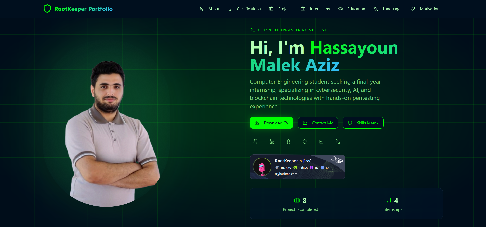
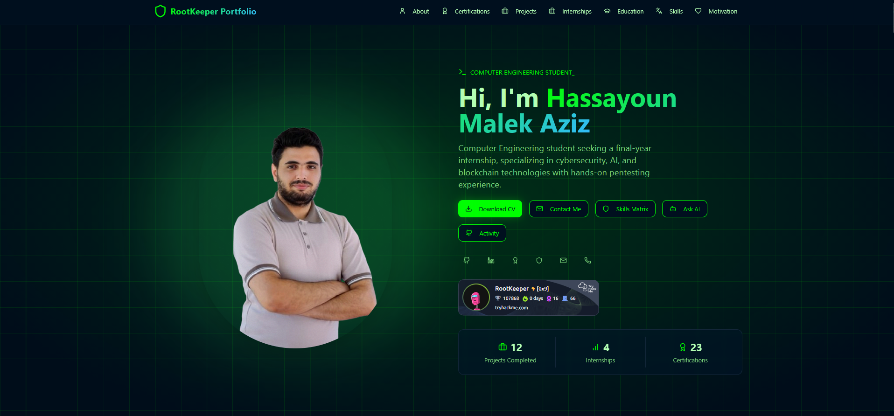

# RootKeeper Portfolio - Full Technical Documentation

## 1) Purpose and Scope

This document is the complete technical reference for the portfolio project in this repository.
It covers:

- Architecture and routing
- UI systems (navigation, theme, language, shortcuts, back-to-top)
- Page-by-page behavior
- Data sources and APIs
- Tooling and dependencies
- Environment setup and troubleshooting

Primary audiences:

- Project owner (maintenance and evolution)
- Future collaborators
- Recruiters or reviewers who want implementation depth

---

## Related Docs

- [API Reference](./API.md)
- [Changelog](./CHANGELOG.md)

## 2) Product Summary

The application is a modern React + TypeScript portfolio with a cybersecurity/AI design language.
It provides:

- Multi-page portfolio experience with route transitions
- Bilingual interface (English/French)
- Theme switching (Light/Dark/System)
- Keyboard-first navigation (shortcuts + command palette)
- AI assistant page backed by a local Express API server
- Activity page with GitHub and TryHackMe integrations
- Contact workflow via EmailJS

## 2.1) Visual Walkthrough (Screenshots and GIF Slots)

### Current Screenshots

| Feature | Preview |
|---|---|
| Home / Hero section |  |
| Portfolio overview layout |  |

### GIF Slots (ready to populate)

Add short GIF recordings in `docs/assets/gifs/` and link them here:

- `navigation-scroll.gif` (desktop + mobile nav interactions)
- `theme-toggle.gif` (light/dark/system switch)
- `shortcuts-and-command-palette.gif` (`Ctrl/Cmd+K`, `?`, section keys)
- `contact-form-flow.gif` (validation + success path)
- `back-to-top.gif` (floating icon behavior)

---

## 3) High-Level Architecture

```mermaid
flowchart TD
  U[User Browser] --> A[React App - Vite]
  A --> R[React Router]
  R --> P1[/]
  R --> P2[/chat]
  R --> P3[/activity]
  R --> P4[/volunteering]
  R --> P5[/blog]

  A --> G1[Global UI Systems]
  G1 --> K[Keyboard Shortcuts]
  G1 --> C[Command Palette]
  G1 --> T[Theme Toggle]
  G1 --> L[Language Toggle]
  G1 --> B[Back To Top]

  A --> S[Contact Form]
  S --> E[EmailJS API]

  P2 --> API[/api/chat]
  P3 --> API2[/api/github-achievements]
  P3 --> API3[/api/tryhackme-stats]

  API --> X[Express server.js]
  API2 --> X
  API3 --> X
  X --> GH[GitHub / GitHub Models APIs]
  X --> THM[TryHackMe API]
```

---

## 4) Runtime Shell and Providers

The app shell is composed in `src/App.tsx`.

Global providers and systems:

- `QueryClientProvider` (`@tanstack/react-query`)
- `ThemeProvider` (`next-themes`, class strategy)
- `LanguageProvider` (custom i18n context)
- `TooltipProvider`
- `Toaster` and `Sonner`
- `Analytics` and `SpeedInsights` from Vercel

Global persistent UI elements:

- `CommandPalette`
- `KeyboardShortcutsModal`
- `BackToTopButton`
- `CookieConsent`

First-visit UX:

- `LoadingScreen` is shown once per browser session
- Session key: `portfolio-loaded`

---

## 5) Route Map

Defined in `src/App.tsx` using lazy loading and `PageTransition`.

| Route | Component | Purpose |
|---|---|---|
| `/` | `Index -> PortfolioLayout` | Main portfolio homepage |
| `/chat` | `Chatbot` | AI assistant chat about portfolio data |
| `/activity` | `Activity` | GitHub + TryHackMe activity dashboard |
| `/volunteering` | `Volunteering` | Timeline of leadership/community roles |
| `/blog` | `Blog` | Coming Soon page for Blog and Write-ups |
| `*` | `NotFound` | Fallback route |

Transition system:

- `AnimatePresence` + `PageTransition` (fade/slide in/out)

---

## 6) Navigation and Interaction Systems

### 6.1 Main Navigation

Implemented in `src/components/portfolio/Navigation.tsx`.

Behavior:

- Fixed top nav with desktop and mobile variants
- In-page smooth scrolling for section anchors
- Route navigation for `/volunteering` and `/blog`
- Active section highlighting via `IntersectionObserver`

Section anchors currently used:

- `#about`
- `#certifications`
- `#projects`
- `#internships`
- `#education`
- `#languages`
- `#motivation`

### 6.2 Theme Toggle (Light / Dark / System)

Implemented in `ThemeToggle.tsx` with `next-themes`.

Features:

- 3 explicit modes: `light`, `dark`, `system`
- Hydration-safe mount guard to avoid mismatch
- Theme is class-based (`darkMode: ["class"]` in Tailwind config)

### 6.3 Language Toggle (EN/FR)

Implemented in `LanguageToggle.tsx` + `LanguageContext.tsx`.

Features:

- Switches between English and French dictionaries
- Persists selection in `localStorage` key: `portfolio-lang`
- Updates `<html lang="...">` dynamically

### 6.4 Back-to-Top Icon/Button

Implemented in `BackToTopButton.tsx`.

Behavior:

- Hidden until page scroll exceeds 300px
- Fixed floating action button (bottom-right)
- Smooth scroll back to top
- Localized `aria-label`

### 6.5 Keyboard Shortcuts (Global)

Implemented in `useKeyboardShortcuts.ts` and `KeyboardShortcutsModal.tsx`.

Global shortcuts:

- `Esc`
  - On non-home route: navigate to `/`
  - On home route: smooth-scroll to top
- `1..7`
  - Quick jump to homepage sections
- `?`
  - Open/close keyboard shortcuts modal
- `Ctrl+K` / `Cmd+K`
  - Open command palette

Input safety:

- Shortcuts are ignored while typing in `input`, `textarea`, or `select`

### 6.6 Command Palette

Implemented in `CommandPalette.tsx` using `CommandDialog` UI.

Groups:

- Pages
- Sections
- Actions

Action examples:

- Toggle dark/light mode
- Toggle EN/FR
- Download CV (tracked)
- Back to top

---

## 7) Homepage Composition

Main composition (`PortfolioLayout.tsx`):

- `Navigation`
- `HeroSection`
- `AchievementsBanner`
- `CertificationsSection`
- `ProjectsSection`
- `InternshipsSection`
- `EducationSection`
- `LanguagesSection`
- `MotivationSection`
- `Footer`
- `HireMeBanner`

### 7.1 Hero Highlights

`HeroSection.tsx` includes:

- CyberParticles visual background
- Typewriter subtitle animation
- Orbiting profile icon system
- Status indicator (availability)
- Primary CTAs:
  - Download CV
  - Contact form
- Secondary CTAs:
  - Skills Matrix modal
  - AI chat page
  - Activity page
- Social links (GitHub, LinkedIn, Kaggle, Credly, TryHackMe, Email, Phone)
- Embedded TryHackMe profile badge iframe

### 7.2 Achievements Banner

`AchievementsBanner.tsx` includes animated count-up metrics with intersection-triggered animation.

### 7.3 Sticky Hire Banner

`HireMeBanner.tsx` provides:

- Fixed bottom CTA bar
- vCard download generation (`.vcf`)
- Direct mail action
- Dismiss control

---

## 8) Additional Pages

### 8.1 Chatbot Page (`/chat`)

`Chatbot.tsx`:

- Conversational UI with user/assistant bubbles
- Context-aware responses from portfolio data (`usePortfolioData`)
- Sends chat requests to local API endpoint: `/api/chat`
- Handles loading state and error fallback

### 8.2 Activity Page (`/activity`)

`Activity.tsx` wraps `CodingActivitySection`.

`CodingActivitySection.tsx` aggregates:

- `CustomGitHubCalendar`
- `GitHubAchievements`
- `TryHackMeStats`

### 8.3 Volunteering Page (`/volunteering`)

`Volunteering.tsx`:

- Grouped timeline by organization type
- Color-coded legends and role badges
- Back-to-portfolio header action

### 8.4 Blog and Write-ups Page (`/blog`)

`Blog.tsx` currently serves as a designed "Coming Soon" page with:

- Header nav and back action
- Gradient/glow background layers
- Launching-soon hero
- Preview cards for planned content tracks

---

## 9) Modals and Detail Views

Interactive modal patterns include:

- `ContactForm`
- `CvDownloadModal`
- `SkillsMatrixModal`
- `ProjectDetailsModal`
- `InternshipDetailsModal`
- `CertificationDetailsModal`

`ProjectDetailsModal` includes:

- Carousel gallery
- Technology badges
- Highlights list
- Optional GitHub source link

---

## 10) Contact Workflow (EmailJS)

Implemented in `ContactForm.tsx`.

Environment variables required:

- `VITE_EMAILJS_SERVICE_ID`
- `VITE_EMAILJS_TEMPLATE_ID`
- `VITE_EMAILJS_USER_ID`

Client-side safeguards:

- Required field checks
- Honeypot field (`website`) to trap bots
- 60s client-side rate limit between submissions
- Detailed error surfacing (status + text)

Template payload fields sent:

- `user_name`
- `user_email`
- `message`
- `title` (mapped from `message`)
- `from_name`
- `from_email`
- `reply_to`
- `name`
- `email`

---

## 11) Backend/API Layer (`server.js`)

The dev server runs alongside Vite (`npm run dev` uses `concurrently`).

### 11.1 POST `/api/chat`

- Uses GitHub Models inference endpoint through `@azure-rest/ai-inference`
- Model: `meta/Llama-3.3-70B-Instruct`
- Auth: `GITHUB_TOKEN` from `.env`

### 11.2 GET `/api/github-achievements`

- Scrapes GitHub achievements page HTML
- Extracts badge image/name pairs
- Deduplicates and returns simplified JSON

### 11.3 GET `/api/tryhackme-stats`

- Fetches public TryHackMe profile stats
- Returns JSON data used by UI cards

---

## 12) Data and Localization Strategy

### 12.1 Translation

`LanguageContext.tsx`:

- Stores translation dictionaries for EN/FR
- Exposes `t(key)` and `setLang(...)`
- Fallback behavior: EN key if missing

### 12.2 Portfolio Data

`usePortfolioData.ts` + `portfolioByLang.ts`:

- Selects language-specific datasets
- Sources:
  - `src/data/portfolio.ts` (EN)
  - `src/data/portfolio.fr.ts` (FR)

---

## 13) Styling and Design System

### 13.1 Core Stack

- Tailwind CSS
- CSS custom properties in `src/index.css`
- shadcn/ui components backed by Radix primitives

### 13.2 Theme Tokens

- HSL token system for light and dark themes
- Custom cyber palette (`--cyber-green`, `--cyber-blue`, etc.)
- Custom gradients and glow shadows

### 13.3 Custom Effects and Utilities

From `index.css`:

- Matrix-style section background layers
- Animated slide-up/fade-in utility classes
- Orbit animations for hero icon ring
- Customized scrollbar styling
- Print stylesheet with non-essential UI hidden

---

## 14) Tooling and Libraries Used

### 14.1 Framework and Language

- React 18
- TypeScript
- Vite

### 14.2 Routing, State, and Data

- `react-router-dom`
- `@tanstack/react-query`

### 14.3 UI, Design, Motion

- Tailwind CSS
- shadcn/ui + Radix UI primitives
- `lucide-react` icons
- `framer-motion`
- `embla-carousel-react`
- `next-themes`

### 14.4 Forms and Validation

- `react-hook-form`
- `@hookform/resolvers`
- `zod`

### 14.5 Integrations and Analytics

- `emailjs-com`
- `@vercel/analytics`
- `@vercel/speed-insights`
- GitHub API / GitHub Models / TryHackMe API

### 14.6 Local API Server

- Express
- CORS
- dotenv
- `@azure-rest/ai-inference`
- `@azure/core-auth`

---

## 15) Scripts and Commands

From `package.json`:

- `npm run dev`
  - Runs Vite frontend + `node server.js`
- `npm run build`
  - Production build
- `npm run build:dev`
  - Development-mode build
- `npm run preview`
  - Preview built output
- `npm run lint`
  - ESLint checks

---

## 16) Environment Variables

### 16.1 Frontend (.env)

```env
VITE_EMAILJS_SERVICE_ID=your_service_id
VITE_EMAILJS_TEMPLATE_ID=your_template_id
VITE_EMAILJS_USER_ID=your_public_key
```

### 16.2 Local API Server (.env)

```env
GITHUB_TOKEN=your_github_models_token
```

Notes:

- Restart dev server after changing `.env`
- Never commit secrets/tokens

---

## 17) Known UX Features Checklist

- [x] Fixed responsive navigation
- [x] Active-section tracking
- [x] Light / Dark / System mode
- [x] EN / FR localization toggle
- [x] Global keyboard shortcuts
- [x] Command palette
- [x] Back-to-top floating button
- [x] First-session loading screen
- [x] Cookie consent banner
- [x] CV preview + download modal
- [x] Contact modal with anti-spam + rate limiting
- [x] Animated route transitions
- [x] Activity dashboards (GitHub + TryHackMe)
- [x] Volunteering timeline page
- [x] Blog/write-ups coming-soon page

---

## 18) Troubleshooting Guide

### 18.1 EmailJS Errors

- `The template ID not found`
  - Wrong template ID or wrong account/workspace mapping
- `Gmail_API: insufficient authentication scopes`
  - Reconnect Gmail service in EmailJS and accept required scopes
- `Email service is not configured`
  - Missing `VITE_EMAILJS_*` vars or dev server not restarted

### 18.2 Chatbot/API Errors

- `GITHUB_TOKEN` missing
  - Set token in `.env` for `server.js`
- `500` on `/api/chat`
  - Verify token validity and outbound network access

### 18.3 Activity Widget Errors

- GitHub achievements empty/failing
  - Check `/api/github-achievements` and GitHub page availability
- TryHackMe stats failing
  - Check `/api/tryhackme-stats` response and external API status

---

## 19) Component Inventory (Portfolio Folder)

Current inventory under `src/components/portfolio`:

- AchievementsBanner
- BackToTopButton
- CertificationDetailsModal
- CertificationsSection
- CodingActivitySection
- CommandPalette
- ContactForm
- ContactSection
- CookieConsent
- CustomGitHubCalendar
- CvDownloadModal
- EducationSection
- Footer
- GitHubAchievements
- HeroSection
- HireMeBanner
- InternshipDetailsModal
- InternshipsSection
- KeyboardShortcutsModal
- LanguagesSection
- LanguageToggle
- LoadingScreen
- MotivationSection
- Navigation
- OrbitingIcons
- PageTransition
- PortfolioLayout
- PortfolioStats
- ProjectDetailsModal
- ProjectsSection
- SkillsMatrixModal
- ThemeToggle
- TryHackMeStats

---

## 20) Maintenance Recommendations

- Keep README/docs synchronized after each feature addition
- Validate all shortcuts after route/navigation changes
- Keep translation keys aligned between EN and FR
- Periodically verify third-party API contracts
- Add tests for key interaction flows (shortcuts, command palette, form guards)

---

Documentation owner: Hassayoun Malek Aziz
Source of truth: this repository's codebase


